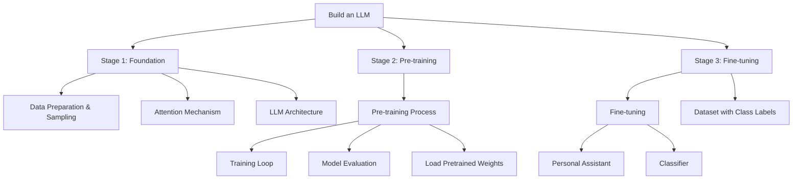

### Attention is All you Need Paper
- The original trasformer was developed for machine translation, translating English texts into German and French. 
- Transformer architecture consists of two submodules an encoder and decoder. 
- The encoder module processes the input text and encodes it into a series of numerical representations or vectors that capture the contexual information of the input.
- The decoder takes these encoded vectors and generates the output to generate text in the target language.
- Both the encoder and decoder consist of many layers connected by a so-called self-attention mechanism.
- Self-attention allows the model to weigh the model the importance of different words or tokens taken in a sequence.
- This allows the model to capture long range dependencies and contexual relationships within the input data enhancing coherence and relevant outputs.
- Later BERT shot for bidirectional encoder representation rom transformers and into various other GPT models after 2018.
- GPT models have demonstrated the phenomonal ability at both zero shot and few shot learning tasks. 
- Zero-shot refers to the ability to generalize to completely unseen tasks without any prior specific examples.
- Few-shot however involves providing a minimal number of examples the user provides as input, such as providing leading questions to the LLM.
- Optimizing your prompt is a high priority for using these technologies effecitely, as input is the only way to make the most of these.
- GPT was originally introduced in the paper "Improving Language Understanding by Generative Pre-Training" by Radford et al from OpenAI.
- GPT 3 is a scaled up version of this model that has more paramters and was trained on a larger dataset.
- GPT 3 has 96 transformer layers and 175 billion parameters in total.
- The ability o GPT's to accuratetly translate other languages was a surprising behavior when it was first observed.
- The ability of LLMs to learn things on their own is called emergent behavior. 

- I love the term autoregressive. Once you get it and remember to practice identifying that with how LLMs work does go a long way into helping into understand how all of fthe subseqent steps in the model lifecycle.
Repeat it in your head as many times as you need and it will stick just like any pattern. Don't mind repeating exposure to the word to sink into long term memory to make sure it sticks its a great test quesyion.

## Build one From Scratch
The three main stages of coding an LLM are implementing the LLM architecture and data preperation process
(stage 1), pretraining an LLM to a foundation model (stage 2), and fine-tuning the foundation
model to become a personal assistant or text classifier. 

## Stage 1
1. Data preperation & sampling
2. Attention  mechanism
3. LLM Architecture

Point to "Building an LLM"

4. Pre-training
During this stage LLMs process text one word at a time. Training LLMs with 
millions to billions of parameters using next-word prediction task yield models to follow general instructions or perform specific 
task targets.

- Deep neural networks like LLMs cannot process raw text 
directly since text is categorical it isnt compatible with math used to implement and train neural networks
- There for words must be stored as continuous-valued vectors.
- Converting data into a vector format is offten referred to as embedding.
- Several types of embeddings have been invented and one popular one is Word2Vec.
- Using a specific neural entwork layer or another pretained model we can enable different data types such as audio and video and text.

### Tokenizing text

An example of text splitting in preperation of embedding.

```python
import re
text = "Salve mundi. Hoc est scribitus."
result = re.split(r'(\s)', text)
print(result)
```

## Stage 2
5. Training loop

Llama3 took took approximately 1.3 million GPU hours of compute for pre-training and utilized 400 TFLOPS of compute.

6. Model evaluation
7. Load pretrained weights

Points to "Foundation model"

8. Finetuning

Fine-tunes the pretrained LLM
Works on Classifier and Personal assistant roles. Personal assistants are an instruction dataset.

## Stage 3
Dataet with class labels

Points to Classifier

### Diagram LLM

